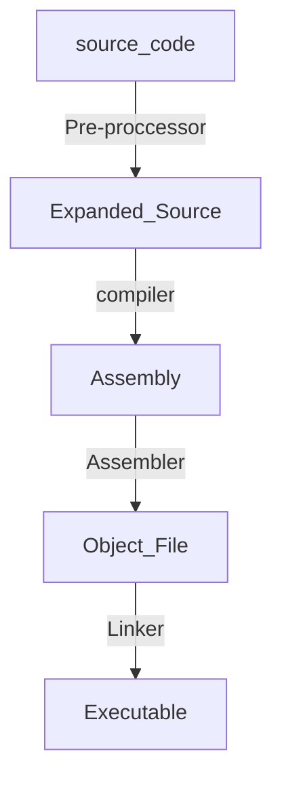
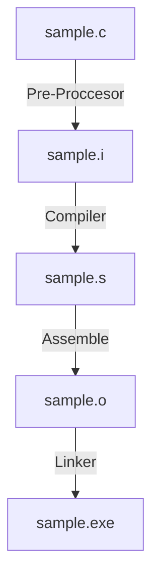

# makes-templates
Set of makefiles templates that I created, documentacition of each one and general documentation of makefiles

# INDICE

- branch `basic` --> general template

# MAKE DOCUMENTATIO

## Behind The Scene
### Process
- **Pre-proccessor (-E)**:
	- Get the **source code (.c)** and generate the **expanded source code (.i)**
- **compiler (-S)**
	- Get **expanded source code (.i)** and generate the **Asembly (.s)**
- **Assembler (-c)**
	- Get the **Asembly (.s)** and generate the **Objet files (.o)**
- **linker**
	- Whit the **Objects Files (.o)** generate the **Executable**



### Files of the process



## Posibles Outputs

Posibles output of **C/C++** program:

- **Binary Executable** --> `a.out`
``` shell
gcc sample.c -o output
```
- **Shared Object/library or Dinamic Library (-shared)**  --> `libSample.so`
```shell
gcc -shared sample.c -o sample.so
```
- **Static Librery (ar rcs)** --> `libSample.a`
	- **ar** is a Unix utility that maintains groups of files as a single archive file
```shell
ar rcs libsample.a sample.o
```
- **Object code (-c)** --> `sample.o`
```shell
gcc -c sample.c -o sample.o
```

## Folder Structure

- **src**
	- source codes files
	- Une folder to each one of the source codes examples
- **bins**
	- binary files
- **libs**
- **objs**
- **sample-makefiles**
- **sahre-header**
- **Experimental**
- **docs** 

## Make vs Makefile

- Make is a tool.
- Make tool needs Makefile as the inputs and process as per the instruction written inside it.
- Make tool shall be use in the same directory where makefile is.
- Make tool is powerful.
- Make tool can detect the **changed source file** and process/build that file only while make is done.
- comments in make files are --> `# comments`
 
- Makefile is a file written in such a way that Make tool can understand.
- Makefile used for automating build process.

## MAKEFILE Content

The `Makefile` contains could the next things:
- Comments 
- Macros/Variables
- Functions
- Instructions/satements

### Targets

Operations that be executed when the `make`command it's executed

```Makefile
targetName: Dependecies/PREREQUISITE
	instructions to make the target using prerequisites
```

- ==**!!!**== The set of **Dependency and prerequisites** are know as **RULES**. 
- ==**!!!**== The set of **instructions** are know as **RECIPE**.

It can be more than one target:
- If it's not specified the `make`command will always **only** executed the first target.
- To execute one target specifically, it have to be specified in the terminal when execute the `make`command.

```bash
  make targetName
```
- Also, It can be use the instruction `.DEFAULT_GOAL = { target_name }`to override the default target.

### Phony Target

A phony target is one that is not really the name of a file; rather it is just a name for a recipe to be executed when you make an explicit request. There are two reasons to use a phony target: to avoid a conflict with a file of the same name, and to improve performance.

¿¿¿???

### Variables

- Same functionality as in any other programming languages.

- Can only be strings

- Single or Double quotes for variable names or values have no meaning to Make

- To Access the variable value:
```make
  $(VARIABLE_NAME)
```

- The variable naming standard says that all variables names must be in capital letters

- ==**!!!**== To **add** content to a variable it's use:
```makefile
VaribleName += Content_to_add
```

- We can change the variable value ( including flags ) when the `make`command is executed.
```shell
make build DEBUG=0
```

- ==**!!!**== only sets variables if they have not yet been set
```makefile
VariableName ?= 1
```

### Flags

- Variables used to have more control of the compiler of all the process. 

- The compiler add many none desired code when executed. 

- It's a good practice to create some variables that have only the flags need and wanted during the compilation

- ==Put and modified them at the start of the **Makefiel

- For C programming:
	- `CC`: Program for compiling C programs. By default is cc
	- `CFLAGS` extra flags to give to the C **compiler**
	- `CPPFLAGS` extra flags to give to the C **pre-processor**
	- `LDFFLAGS`: Extra flags to give to the linker
	
- This have predefine values ( to see them ):
```shell
make -p
```

#### Pre proccesor Flags
- `-I`used to specified to the compiler the directories have to search for headers files `.h`
	- `-I./`search in the correct directory
	- 
#### Compiler Flags
#### Linker Flags 

### Others Flagss
- `-std`
- `make -p dir` --> to indicate that if the directory is create don't crated another time

## Function


## MAKEFILE Important Shortcuts && Terminal Commands in Targets

- ```$@```: the file name of the target

- ```$<```: the name of the first dependency

- ```$^```: the names of all dependencies

- Add an `@` before a command to stop it from being printed in terminal when executed `make`

- Each command is run in an own shell

## Notes 

- gcc -lm ¿?

### Links of libraries


# Incremental Build

# Requirements of my Makefiel pattern  